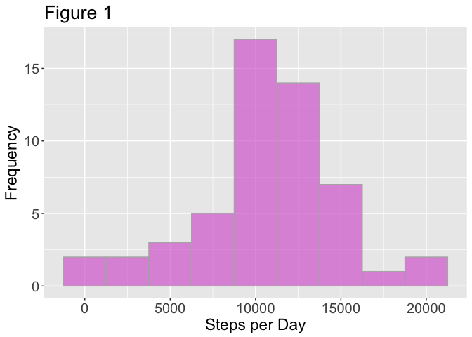
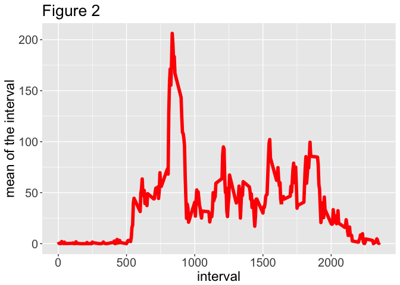
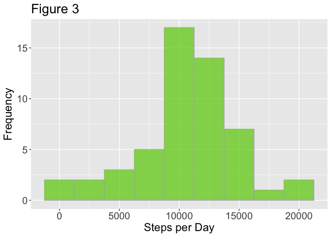
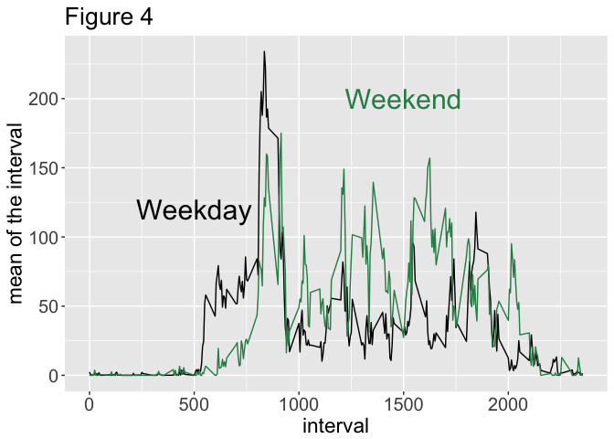

# PA1_template
DanBeaton  
3/26/2017  

#Data Science Course Reproducible Research, Week2.


This assignment analyses the dataset obtained from personal activity monitors.  
Load the dataset into the working directory:


```r
activity = read.csv("activity.csv", header = T)
```

Data was collected at 5 minute intervals spanning the dates 2012-10-01 to 2012-11-30
The dataset is stored in a comma-separated-value (CSV) file and there are a total of 17,568 observations in this dataset.


```r
head(activity)
```

```
##   steps       date interval
## 1    NA 2012-10-01        0
## 2    NA 2012-10-01        5
## 3    NA 2012-10-01       10
## 4    NA 2012-10-01       15
## 5    NA 2012-10-01       20
## 6    NA 2012-10-01       25
```

```r
tail(activity)
```

```
##       steps       date interval
## 17563    NA 2012-11-30     2330
## 17564    NA 2012-11-30     2335
## 17565    NA 2012-11-30     2340
## 17566    NA 2012-11-30     2345
## 17567    NA 2012-11-30     2350
## 17568    NA 2012-11-30     2355
```

```r
dim(activity)
```

```
## [1] 17568     3
```


# Plot a Histogram of the Number of Steps Taken per Day


```r
dfd = aggregate(steps ~ date, data = activity, sum)
dim(dfd)
```

```
## [1] 53  2
```


```r
library(ggplot2)
```

```
## Warning: package 'ggplot2' was built under R version 3.2.5
```

```r
ggplot(dfd, aes(steps)) +
  geom_histogram(fill = "orchid", alpha = 0.7, color = "grey70", binwidth = 2500) +
  theme(plot.title=element_text(size = 20),
        axis.text.x = element_text(size = 15),
        axis.text.y = element_text(size = 15),
        axis.title.y = element_text(size = 17),
        axis.title.x = element_text(size = 17)) +
  labs(y = "Frequency", x = "Steps per Day") + 
  ggtitle("Figure 1")
```

<!-- -->

# Calculate the mean and median number of steps taken per day

For this part of the assignment, you can ignore the missing values in the dataset.
Calculate the total number of steps taken per day


```r
mean.steps = mean(dfd$steps)
mean.steps
```

```
## [1] 10766.19
```


```r
median.steps = median(dfd$steps)
median.steps
```

```
## [1] 10765
```

The mean number of steps per day is 1.0766189\times 10^{4}.
The median number of steps per days is 10765.

The mean and median are basically the same value.

## What is the average daily activity pattern?

Make a time series plot (i.e. 𝚝𝚢𝚙𝚎 = "𝚕") of the 5-minute interval (x-axis) and the average number of steps taken, averaged across all days (y-axis).


```r
library(plyr)
```

```
## Warning: package 'plyr' was built under R version 3.2.5
```

```r
df.ave = ddply(activity, ~interval, summarise, mean = mean(steps, na.rm = T))
```


```r
ggplot(df.ave, aes(interval, mean)) +
  geom_line(color = "red", lwd = 2) +
  theme(plot.title=element_text(size = 20),
        axis.text.x = element_text(size = 15),
        axis.text.y = element_text(size = 15),
        axis.title.y = element_text(size = 17),
        axis.title.x = element_text(size = 17)) +
  labs(x= "interval", y = "mean of the interval") +
  ggtitle("Figure 2")
```

<!-- -->


### Which 5-minute interval, on average across all the days in the dataset, contains the maximum number of steps?


```r
df.max.int = df.ave$interval[which.max(df.ave$mean)]
df.max.int
```

```
## [1] 835
```

```r
max.int = max(df.ave$mean)
max.int
```

```
## [1] 206.1698
```

The interval with the maximum actitivty = 835.
This interval corresponds to an actvity of 206.1698113.


# Imputing Missing Values

###Calcluate the number of missing values "NA"


```r
length.act = length(activity$steps)
numb.na = sum(is.na(activity$steps))
numb.na
```

```
## [1] 2304
```

The total number of missing values in the 'activity' dataset is 2304.

###Convert the NAs to the mean value of the total activity


```r
calcMean = function(x) replace(x, is.na(x), mean(x, na.rm = T))

activity2 = ddply(activity, ~interval, transform, steps = calcMean(steps))

sum(is.na(activity2$steps))
```

```
## [1] 0
```


#Replot the historgram with the NAs replaced with the mean values


```r
df.ave2 = ddply(activity2, ~interval, summarise, mean = mean(steps, na.rm = T))
dfd2 = aggregate(steps ~ date, data = activity, sum)
```


```r
ggplot(dfd2, aes(steps)) +
  geom_histogram(fill = "chartreuse3", alpha = 0.7, color = "grey70", binwidth = 2500) +
  theme(plot.title=element_text(size = 20),
        axis.text.x = element_text(size = 15),
        axis.text.y = element_text(size = 15),
        axis.title.y = element_text(size = 17),
        axis.title.x = element_text(size = 17)) +
  labs(y = "Frequency", x = "Steps per Day") + 
  ggtitle("Figure 3")
```

<!-- -->


For this part of the assignment, you can ignore the missing values in the dataset.
Calculate the total number of steps taken per day


```r
mean.steps2 = mean(dfd2$steps)
mean.steps2
```

```
## [1] 10766.19
```

```r
(abs(mean.steps - mean.steps2)/mean.steps)*100
```

```
## [1] 0
```


```r
median.steps2 = median(dfd2$steps)
median.steps2
```

```
## [1] 10765
```

```r
(abs(median.steps - median.steps2)/mean.steps)*100
```

```
## [1] 0
```

The mean number of steps per day with NAs imputed to the mean value is 1.0766189\times 10^{4}.
The median number of steps per days with NAs imputed to the mean value is 10765.

####Do these values differ from the estimates from the first part of the assignment? 

The adjusted mean and median values are basically the same values as the un-adjusted 
mean and median values.


##What is the impact of imputing missing data on the estimates of the total daily number of steps?

Because the mean and median values are similar to each other in the original dataset, 
the imputed NAs replaced with the mean values, do not alter the overall
distribution of the activity levels within each of the 5 minute inervals.


#Are there differences in activity patterns between weekdays and weekends?


```r
#convert the 'date' colum to a date format

str(activity)
```

```
## 'data.frame':	17568 obs. of  3 variables:
##  $ steps   : int  NA NA NA NA NA NA NA NA NA NA ...
##  $ date    : Factor w/ 61 levels "2012-10-01","2012-10-02",..: 1 1 1 1 1 1 1 1 1 1 ...
##  $ interval: int  0 5 10 15 20 25 30 35 40 45 ...
```

```r
activity$date = as.Date(activity$date)
str(activity)
```

```
## 'data.frame':	17568 obs. of  3 variables:
##  $ steps   : int  NA NA NA NA NA NA NA NA NA NA ...
##  $ date    : Date, format: "2012-10-01" "2012-10-01" ...
##  $ interval: int  0 5 10 15 20 25 30 35 40 45 ...
```

```r
# create labels for the weekedays

library(dplyr)
```

```
## Warning: package 'dplyr' was built under R version 3.2.5
```

```
## 
## Attaching package: 'dplyr'
```

```
## The following objects are masked from 'package:plyr':
## 
##     arrange, count, desc, failwith, id, mutate, rename, summarise,
##     summarize
```

```
## The following objects are masked from 'package:stats':
## 
##     filter, lag
```

```
## The following objects are masked from 'package:base':
## 
##     intersect, setdiff, setequal, union
```

```r
# create a new colum with the levels 'weekday' and 'weekend'

activity = mutate(activity, day = weekdays(date))


# subset

for (i in 1:length(activity$day)) {
  
  if (activity[i,4] == "Saturday" | activity[i,4] == "Sunday" ) {
    activity[i,4] = "weekend"
    }
  
  else {
    activity[i,4] = "weekday"
  }
}


activity$day = as.factor(activity$day)


head(activity)
```

```
##   steps       date interval     day
## 1    NA 2012-10-01        0 weekday
## 2    NA 2012-10-01        5 weekday
## 3    NA 2012-10-01       10 weekday
## 4    NA 2012-10-01       15 weekday
## 5    NA 2012-10-01       20 weekday
## 6    NA 2012-10-01       25 weekday
```


### Create line plots comparing activity levels for weekends and weekdays


```r
weekday = subset(activity, day == "weekday")
weekend = subset(activity, day == "weekend")

df.wd = ddply(weekday, ~interval, summarise, mean = mean(steps, na.rm = T))
df.we = ddply(weekend, ~interval, summarise, mean = mean(steps, na.rm = T))
```


```r
g2.line = ggplot() +
  geom_line(data =df.wd, aes(x = interval, y = mean)) + 
  geom_line(data =df.we, aes(x = interval, y = mean), color = "seagreen4") + 
  theme(legend.text = element_text(size = 22)) +
  theme(plot.title=element_text(size = 20),
        axis.text.x = element_text(size = 15),
        axis.text.y = element_text(size = 15),
        axis.title.y = element_text(size = 17),
        axis.title.x = element_text(size = 17)) +
  labs(x= "interval", y = "mean of the interval") +
  annotate("text", x = 500, y = 120, label = "Weekday", size = 8) +
  annotate("text", x = 1500, y = 200, label = "Weekend", size = 8, color = "seagreen4") +
  ggtitle("Figure 4")

g2.line
```

<!-- -->

